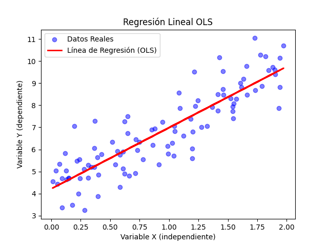

# **Formulación matemática**

## **Regresiones lineales**

### **Mínimos cuadrados ordinarios (OLS)**

Para un conjunto de datos con $\eta$ observaciones, tenemos una variable independiente $y$, que es dependiente de $x$. Queremos encontrar una relación lineal de la forma:

$$
\begin{equation}
    y_i = \beta_0 + \beta_1 x  _i + \varepsilon_i
\end{equation}
$$

donde:

* $y_i$ es la variable dependiente (observado).
* $x_i$ la variable independiente.
* $\beta_0$ la intersección.
* $\beta_1$ la pendiente.
* $\varepsilon_i$ es el residuo o término de error.

### Residuos

En la práctica los puntos no siempre caen perfectamente sobre una línea recta, siempre habrá una diferencia entre el valor real $(y_i)$ y el valor que se predice $\hat{y_i}$. A esta diferencia se le conoce como residuo ($\varepsilon_i$):

$$
\begin{equation}
    \varepsilon_i = y_i - \hat{y_i}
\end{equation}
$$

De (1) encontramos la igualdad $\hat{y} = \beta_0 + \beta_1 x_1$ que sustituimos en (2)

$$
\begin{equation}
    \varepsilon = y_i - (\beta_0 + \beta_1 x_i)
\end{equation}
$$

El objetivo de OLS es minimizar los residuos.

### Función de costo (Suma de errores cuadráticos)

Este es un método de optimización. Definimos a la función de costo como $S$. Esta función depende de los parámetros desconocidos $\beta_0$ y $\beta_1$

$$
\begin{equation}
    S(\beta_0,\beta_1) = \sum_{i=1}^n (y_i - \hat{y}_i)^2
\end{equation}
$$

Sustituyendo la 3 en 4:

$$
\begin{equation}
    S(\beta_0,\beta_1) = \sum_{i=1}^n (y_i - (\beta_0 + \beta_1 x_i))^2
\end{equation}
$$

### Optimización
Para encontrar los valores óptimos de $\beta_0$ y $\beta_1$ para la función de costo, usamos sus derivadas parciales respecto a cada coeficiente e igualamos a cero.

1. **Derivada respecto a $\beta_0$:**

$$
\begin{equation}
\frac{\partial S}{\partial \beta_0} = \frac{\partial \left( \displaystyle\sum_{i=1}^n \left(y_i - \left(\beta_0 + \beta_1 x_i\right)\right)^2\right)}{\partial \beta_0}
\end{equation}
$$

Resolviendo la derivada tenemos:

$$
\begin{equation}
\frac{\partial S}{\partial \beta_0} =-2 \sum_{i=1}^{n}(y_i -\beta_0 - \beta_1 x_i)
\end{equation}
$$

Igualamos a cero y simplificamos

$$
    -2 \sum_{i=1}^{n}(y_i -\beta_0 - \beta_1 x_i) = 0
$$

$$
    \sum_{i=1}^{n}y_i -n\beta_0 - \beta_1 \sum_{i=1}^n x_i = 0
$$
___
***Recordatorio***: $\displaystyle\sum _{i=1}^{n} \beta_0 = n\beta_0$
___

Despejamos $\beta_1$

$$
    \beta_0 =  \frac{- \displaystyle\sum^{n}_{i=1} y_i +\beta_i \displaystyle\sum^{n}_{i=1} x_i}{n} = - \frac{\displaystyle\sum^{n}_{i=1} y_i}{n} +\beta_i \frac{ \displaystyle\sum^{n}_{i=1} x_i}{n}
$$

Esta es la primera fórmula clave.

$$
\begin{equation}
    \beta_0 = \bar{y} - \beta_1 \bar{x}
\end{equation}
$$

2. **Derivada respecto a $\beta_1$:**

$$
\begin{equation}
\frac{\partial S}{\partial \beta_1} = \frac{\partial \left( \displaystyle\sum_{i=1}^n \left(y_i - \left(\beta_0 + \beta_1 x_i\right)\right)^2\right)}{\partial \beta_1}
\end{equation}
$$

Resolviendo la derivada por regla de la cadena: 

$$
\begin{equation}
\frac{\partial S}{\partial \beta_1} =-2 \sum_{i=1}^{n}x_i(y_i -\beta_0 - \beta_1 x_i)
\end{equation}
$$

Sustituyendo 8 en 10 e igualando a 0

$$
\sum_{i=1}^{n}x_i(y_i -(\bar{y} - \beta_1\bar{x}) - \beta_1 x_i)=0
$$

Realizamos un poco de álgebra

$$
\sum_{i=1}^{n}x_i y_i -(\bar{y} - \beta_1\bar{x})\sum_{i=1}^{n}x_i - \beta_1 \sum_{i=1}^{n}x_i^2=0
$$

$$
\sum_{i=1}^{n}x_i y_i -\bar{y}\sum_{i=1}^{n}x_i + \beta_1\bar{x}\sum_{i=1}^{n}x_i - \beta_1 \sum_{i=1}^{n}x_i^2=0
$$

$$
\sum_{i=1}^{n}x_i y_i -\bar{y}\sum_{i=1}^{n}x_i + \beta_1 \left(\bar{x}\sum_{i=1}^{n}x_i - \sum_{i=1}^{n}x_i^2\right)=0
$$

Despejamos $\beta_1$

$$
-\beta_1 \left(\bar{x}\sum_{i=1}^{n}x_i - \sum_{i=1}^{n}x_i^2\right) = \sum_{i=1}^{n}x_i y_i -\bar{y}\sum_{i=1}^{n}x_i 
$$

$$
\begin{equation}
\beta_1  =\frac{\displaystyle \bar{y}\sum_{i=1}^{n}x_i- \sum_{i=1}^{n}x_i y_i}{\displaystyle\left(\bar{x}\sum_{i=1}^{n}x_i - \sum_{i=1}^{n}x_i^2\right)}
\end{equation}
$$

Para llegar a donde queremos, multiplicamos por un + la expresión y esto se logra con un menos en el numerador y así como en el denominador $(-/- = +)$

$$
\beta_1  = \frac{\displaystyle \sum_{i=1}^{n}x_i y_i- \bar{y}\sum_{i=1}^{n}x_i}{\displaystyle\left( \sum_{i=1}^{n}x_i^2 - \bar{x}\sum_{i=1}^{n}x_i\right)}
$$

$$
\beta_1  = \frac{\displaystyle \sum_{i=1}^{n}x_i y_i - n \bar{y} \bar{x}}{\displaystyle\left( \sum_{i=1}^{n}x_i^2 -n \bar{x}^2\right)}
$$

----

Usamos las siguientes propiedades:

Covarianza

$$
    \sum_{i=1}^{n}x_i y_i - n\bar{y}\bar{x} = \sum_{i=1}^n (x_i - \bar{x})(y_i-\bar{y})
$$

Varianza

$$ 
    \sum_{i=1}^n x^2_i - n\bar{x}^2 = \sum_{i=1}^n(x_i -\bar{x})^2
$$

Estas propiedades se pueden probar simplemente expandiendo las expresiones de la izquierda.

----

$$
\begin{equation}
\beta_1  = \frac{\displaystyle \sum_{i=1}^n (x_i - \bar{x})(y_i-\bar{y})}{\displaystyle \sum_{i=1}^n(x_i -\bar{x})^2}
\end{equation}
$$

$$
\beta_1 = \frac{\text{Covarianza}(x,y)}{\text{Varianza}(x)}
$$